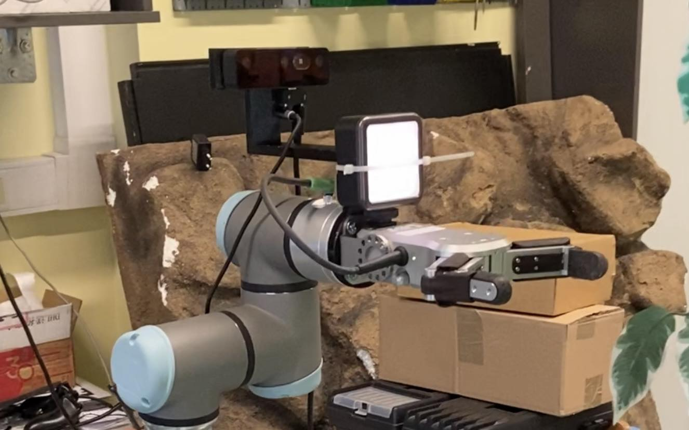

# Implementacja prototypu systemu zbioru owoców za pomocą ramienia robotycznego z wizyjnym sprzężeniem zwrotnym

## Opis

Projekt zawiera kompleksowe oprogramowanie, które jest w stanie wykonać zadanie identyfikacji, a następnie zbioru jabłka za pomocą robota UR3e, kamery OAK-D Pro oraz grippera RG2. Po poprawnym montażu wszystkich elementów oraz uruchomieniu wymaganych węzłów, robot ustawi się w pozycji gotowej do skanowania drzewa. Jeśli w polu widzenia kamery znajdzie się jabłko, robot wykona ruch do pozycji zbioru, a następnie zbierze owoc. Po zakończeniu zbioru, robot powróci do pozycji gotowej do skanowania drzewa i będzie oczekiwał na poawienie się kolejnego jabłka.

## Struktura węzłów i tematów

### Węzeł camera_control_node

Węzeł ten odpowiada za przetwarzanie obrazu z kamery. Odczytane dane procesuje za pomocą sieci neuronowej Yolo v8, a po wykryciu jabłka przekazuje robotowi informację o poziomym i pionowym kierunku, w którym powinien się poruszyć. Dzieje się to za pomocą tematu `custom_camera`. Węzeł ten jest także odpowiedzialny za mierzenie oraz przekazywanie pomiaru odległości do jabłka - informacja ta jest niezbędna, aby przesunąć robota o prawidłową wartość.

### Węzeł gripper_control_node

Ten węzeł odpowiada z kolei za zamykanie oraz otwieranie chwytaka. Nasłuchuje on poleceń na temacie `custom_gripper`. W przypadku otrzymania komendy otwarcia bądź zamknięcia, przesyła on odpowiednią funkcję wraz z jej wywołaniem do kontrolera robota. Po 4 sekundach aktywuje serwis `/dashboard_client/play` odpowiedzialny za przywrócenie kontroli nad robotem do bloku programu `External Control` - dzięki temu w dalszym ciągu będziemy posiadali możliwość sterowania UR3e z poziomu ROS2.

### Węzeł master_node

Jest to węzeł odpowiedzialny za poruszanie ramieniem robotycznym. To on odpowiada za ustawienie robota w pozycji wyszukiwania jabłek oraz za poruszanie nim w odpowiednią stronę wzdłuż osi poziomej oraz pionowej. Subskrybuje on temat `custom_camera` i na podstawie odczytanych z niego danych wykonuje odpowiednie ruchy robotem. W przypadku, gdy chce zacisnąć chwytak na jabłku, publikuje odpowiednią komendę na temacie `custom_gripper` i odczekuje 5 sekund, po czym przenosi jabłko do punktu docelwego. 

### Temat custom_camera

Temat odpowiedzialny za przekazywanie danych o pozycji jabłka względem kamery. Przyjmowany typ danych to: `{data: {x: string, y: string, depth: string}}`.

### Temat custom_gripper

Temat ten odpowiada z kolei za sterowanie chwytakiem. Przyjmowany typ danych to: `{data: string}`.

## Wymagany sprzęt

- Ramię robotyczne Universal Robot 3e,
- Kamera OAK-D Pro,
- Uchwyt na kamerę,
- Chwytak RG2,
- Naświetlacz (zalecany, lecz nie wymagany)

## Konfiguracja sprzętu

### Robot UR3e

Robota należy podłączyć do routera. Podłączenie naszych komputerów do tego samego routera pozwoli na komunikację z robotem. W konfiguracji robota (na Teach Pendancie) należy zaznaczyć opcję "Enable Remote Control", ustawić pole "Host IP" na adres naszego komputera, oraz dodać do programu robota blok "External Control".

### Kamera OAK-D Pro

Konieczne jest jej umocowanie za pomocą zaprojektowanego przez nas uchwytu. Następnie należy podłączyć ją za pomocą dwóch przewodów - jednego zasilającego i drugiego, służącego do transferu danych. Przewód odpowiadający za transmisję danych podłączamy do komputera, na którym będzie uruchomiony węzeł odpowiadający za obsługę kamery.

### Chwytak RG2

Chwytak należy zamocować na końcu ramienia robota oraz podłączyć do portu znajdującego się w pobliżu końcówki. Istotnym jest, aby najpierw przymocować kamerę na uchwycie.

## Instalacja

Aby uruchomić projekt, należy wykonać następujące kroki:

1. Zainstalować wymagane oprogramowanie: ROS2 humble, python3, depthai, ultralytics,
2. Należy zbudować projekt za pomocą komendy `colcon build` oraz `source install/setup.bash`,
3. Następnie wpisujemy komendę `ros2 launch ur_robot_driver ur_control.launch.py ur_type:=ur3e robot_ip:=<ADRES_IP_ROBOTA> initial_joint_controller:=scaled_joint_trajectory_controller launch_rviz:=false headless_mode:=false`,
4. W drugim oknie terminala uruchamiamy moveit2 komendą: `ros2 launch ur_moveit_config ur_moveit.launch.py ur_type:=ur3e`,
5. W kolejnym oknie terminala uruchamiamy węzeł odpowiedzialny za obsługę kamery: `ros2 run camera_control camera_control_node`,
6. Następnie należy uruchomić węzeł odpowiedzialny z sterowanie chwytakiem: `ros2 run gripper_control gripper_control_node`,
7. Ostatnim krokiem jest uruchomienie węzła odpowiedzialnego za poruszanie robotem: `ros2 launch ur_mover master_node.launch.py`

## Autorzy
- Patryk Marczak,
- Kacper Nowaczyk
